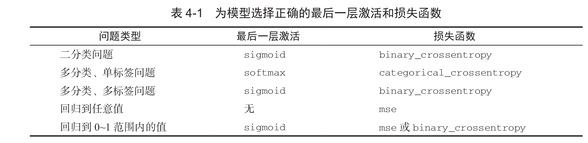

#### 深度（机器）学习基础：
- 损失函数：用来衡量网络输出结果的质量

+ 优化器：将损失值作为反馈信号来调节权重

- SVM: 目标是通过在属于两个不同类别的两组数据点之间找到良好决策边界(decision boundary)来解决分类问题

    + SVM 通过两步来寻找决策边界:
     
         - 1.将数据映射到一个新的高维表示,这时决策边界可以用一个超平面来表示(如果数据是二维的,那么超平面就是一条直线)
     
         + 2.尽量让超平面与每个类别最近的数据点之间的距离最大化,从而计算出良好决策边界(分割超平面),这一步叫作间隔最大化(maximizing the margin)
    
* 决策树(decision tree): 是类似于流程图的结构,可以对输入数据点进行分类或根据给定输入来预测输出值

- 随机森林(random forest): 它引入了一种健壮且实用的决策树学习方法,即首先构建许多决策树,然后将它们的输出集成在一起

+ 深度学习从数据中进行学习时有两个基本特征:
    
    - 第一,通过渐进的、逐层的方式形成越来越复杂的表示
    
    + 第二,对中间这些渐进的表示共同进行学习,每一层的变化都需要同时考虑上下两层的需要
    
- 关于类和标签的说明：在机器学习中,分类问题中的某个类别叫作类(class)、数据点叫作样本(sample)、某个样本对应的类叫作标签(label)

#### 神经网络的数学基础

- 神经网络的核心组件是层(layer),它是一种数据处理模块,你可以将它看成数据过滤器，进去一些数据,出来的数据变得更加有用。大多数深度学习都是将简单的层链接起来,从而实现渐进式的数据蒸馏(data distillation)

* logitic 不是回归是分类

- 降维(dimensionality reduction)和聚类(clustering)都是众所周知的无监督学习方法

+ 三种经典的评估方法:简单的留出验证、K 折验证,以及带有打乱数据的重复 K 折验证

- 数据预处理的目的是使原始数据更适于用神经网络处理,包括向量化、标准化、处理缺失值和特征提取

+ 防止神经网络过拟合的常用方法包括: 获取更多的训练数据、减小网络容量、添加权重正则化、添加 dropout

-  

+ 使用预训练网络有两种方法:特征提取(feature extraction)和微调模型(fine-tuning) 

- 冻结(freeze)一个或多个层是指在训练过程中保持其权重不变。(如果不这么做,那么卷积基之前学到的表示将会在训练过程中被修改。因为其上添加的 Dense 层是随机初始化的,所以非常大的权重更新将会在网络中传播,对之前学到的表示造成很大破坏)
